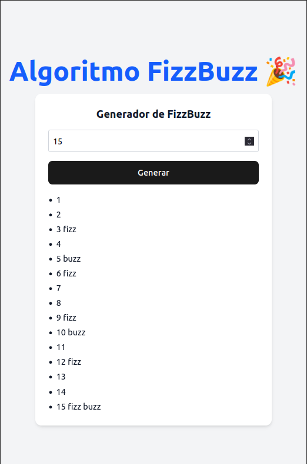

# 🧠 FizzBuzz con Vue 3 + TypeScript

Este proyecto es una pequeña aplicación que implementa el clásico algoritmo de **FizzBuzz** utilizando **Vue 3**, **Composition API** y **TypeScript**. Fue creado como una práctica para reforzar conceptos básicos de algoritmos y lógica de programación.

## 📚 ¿Qué es FizzBuzz?

FizzBuzz es un ejercicio algorítmico clásico que consiste en imprimir los números del 1 al N, pero:
- Si el número es divisible por 3, se imprime `Fizz`
- Si es divisible por 5, se imprime `Buzz`
- Si es divisible por **ambos**, se imprime `FizzBuzz`
- En los demás casos, se imprime el número

---

## 🛠️ Tecnologías usadas

- [Vue 3](https://vuejs.org/)
- [Vite](https://vitejs.dev/)
- [TypeScript](https://www.typescriptlang.org/)
- [TailwindCSS](https://tailwindcss.com/) *(opcional)*

---

## 🖼️ Vista previa

---

## 🔗 Demo en vivo

[Haz clic aquí para ver la app funcionando](https://vue3-fizzbuzz-ts.vercel.app/)

